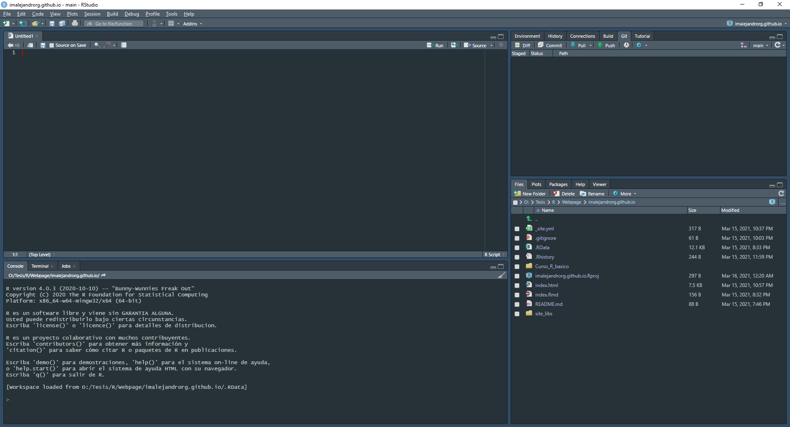

# Introducción a R
```{r include=FALSE}
library(knitr)
library(bookdown)
library(vegan)
library(tidyverse)
library(kableExtra)
```

En esta lección veremos las nociones más básicas de R y RStudio y podremos realizar análisis simples.

## Interfaz
R Studio cuenta con 4 ventanas esenciales: 

1) La *consola*, que es donde se ejecutan los comandos y se visualizan los outputs de nuestros análisis.

2) Los *scripts*, que corresponde a la ventana superior izquierda. No solamente se visualizan scripts, también se pueden trabajar otros formatos, aunque generalmente será donde nosotros escribamos los comandos que la consola va a ejecutar.

3) El *Envirnoment* y el *History* que corresponden a la ventana superior derecha, aunque también cuenta con otras herramientas útiles como *Build* y *Git* que se utilizan en cuestiones más avanzadas.

4) Los *Files*, *Packages* y *Plots* así como la ventana de *Help* que corresponden a la esquina inferior derecha. Básicamente estas son las 4 pestañas de esta ventana que estaremos utilizando.
```{r echo=FALSE, message=FALSE, warning=FALSE, paged.print=FALSE}

```

Adicionalmente, en la ventana de ***Tools -> Global Options -> Appearance*** podemos configurar los colores de nuestra interfaz, el tamaño de la fuente, el zoom, el tema del editor y la tipografía.
```{r echo=FALSE, message=FALSE, warning=FALSE, paged.print=FALSE, fig.align = "center"}
knitr::include_graphics("GlobalOptions.png", dpi = 100)
```

```{r echo=FALSE, message=FALSE, warning=FALSE, paged.print=FALSE, fig.align = "center"}
knitr::include_graphics("Apariencia.png", dpi = 120)
```

Personalmente encuentro los colores oscuros más cómodos para trabajar, por eso elegí el tema **Material**.

## Creando nuestro primer proyecto
Una vez que nos familiarizamos con la interfaz, es momento de crear nuestro primer proyecto. Para esto, debemos dar clic en ***File -> New Project*** para que nos aparezca una ventana como la siguiente.
```{r echo=FALSE, message=FALSE, warning=FALSE, paged.print=FALSE, fig.align = "center"}
knitr::include_graphics("NProj.png", dpi = 120)
```

Creamos un nuevo directorio que se guarda por defecto en la carpeta de *Documentos* de nuestro ordenador.

SE RECOMIENDA NO DEJAR ESPACIOS EN EL NOMBRE. En su lugar, podemos utilizar guión bajo (_), el símbolo de menos (-) o un punto (.).
Una vez creado nuestro proyecto, vamos a crear un nuevo archivo script tecleando Ctrl + Shitf + N. Deberíamos tener un ambiente de trabajo más o menos así.

```{r echo=FALSE, message=FALSE, warning=FALSE, paged.print=FALSE, fig.align = "center"}
knitr::include_graphics("Proj1.png", dpi = 120)
```
Otra recomendación es guardar nuestro script en la misma carpeta del proyecto, así como las bases de datos y demás archivos que vayamos a utilizar.

Para saber cuál es la carpeta de nuestro proyecto, podemos teclear el siguiente comando en la consola.
```{r}
getwd()
```
Para cambiar el directorio de trabajo, simplemente tecleamos en la consola la siguiente función.
```{r}
setwd("O:/Documentos/R_Basico")
getwd()
```
De esta manera cambiamos el directorio de nuestro proyecto actual y sabemos en qué carpeta ingresar nuestros archivos. Para guardar nuestro script simplemente hacemos clic en icono del disquete o con las teclas Ctrl + S. Recuerda que es recomendable guardar el script en la misma carpeta que nuestro proyecto.

## Objetos y variables
Para que un comando que queramos ejecutar permanezca almacenado, debemos asignar un nombre al resultado. La manera en la que R hace esto es a través de los símbolos *<-* o *=* (cuyo atajo de escritura es Alt + -). Por ejemplo, si queremos realizar una suma de 5 + 5 pondríamos el siguiente código en la consola.
```{r echo=TRUE, message=FALSE, warning=FALSE, paged.print=FALSE}
5 + 5
```

Sin embargo, si queremos almacenar este resultado necesitamos nombrar a una variable con este resultado. Por ejemplo, una variable llamada "suma".
```{r}
suma <- 5 + 5
suma
```

Como podemos ver en ambos casos obtenemos los mismos resultados. Sin embargo, en el segundo caso encontraremos una variable llamada "suma" en nuestro *Environment* en el panel superior derecho.
```{r echo=FALSE, message=FALSE, warning=FALSE, paged.print=FALSE, fig.align = "center"}
knitr::include_graphics("Variable.png", dpi = 120)
```

En caso de que estemos interesados en asignar valores categóricos, estos deben estar encomillados.
```{r echo=TRUE, message=FALSE, warning=FALSE, paged.print=FALSE}
letraA <- "A"
```

De nuevo se agregará esta variable a nuestro *Environment*.
```{r echo=FALSE, message=FALSE, warning=FALSE, paged.print=FALSE, fig.align = "center"}
knitr::include_graphics("Variable2.png", dpi = 120)
```

Para corroborar el tipo de dato que tenemos podemos utilizar la función *class(x)* donde x es el nombre de nuestra variable.
```{r echo=TRUE, message=FALSE, warning=FALSE, paged.print=FALSE}
class(letraA)
class(suma)
```

Para los análisis de datos de naturaleza biológica normalmente se trabaja con matrices de datos con múltiples caracteres tanto categóricos como cuantitativos, que en R corresponde a un data frame. Por ejemplo, los datos de una matriz llamada *dune* del paquete **vegan** corresponde a una matriz de datos.
```{r echo=TRUE}
data("dune")
class(dune)
```
```{r echo=FALSE}
knitr::kable(dune) %>% kable_styling(bootstrap_options = c("striped", "bordered", "hover", "condensed"), full_width = TRUE) %>% scroll_box(width = "910px")
```

## Importar datos a R
La mayor parte del tiempo lo que queremos hacer es importar nuestros propios datos a R. En este caso utilizaremos las matrices de datos presentadas en el libro de @Palacio2020. Utilizaremos una base de datos de aves del capítulo 6 del libro de @Palacio2020.

**Descargar:** ["Aves.txt"](https://fundacionazara.org.ar/img/libros/analisis-multivariado-para-datos-biologicos/Aves.txt)

Una vez que tenemos nuestra base de datos en la carpeta de nuestro proyecto, la importamos a través de la función *read.table()*.
```{r}
Aves <- read.table("Aves.txt")
View(Aves)
```

```{r echo=FALSE}
knitr::kable(Aves) %>% kable_styling(bootstrap_options = c("striped", "bordered", "hover", "condensed"), full_width = TRUE) %>% scroll_box(width = "910px")
```

También podemos importar archivos .csv utilizando la función *read.csv()*.
```{r}
Aves_csv <- read.csv("Aves.csv")
```

Así obtendríamos la misma tabla anterior.

En caso de que queramos leer archivos excel, podemos hacerlo utilizando la librería *readxl*. En caso de ya tener instalado el paquete no es necesario que pongan la función *install.packages("readxl")*, al ya tenerlo instalado yo omití esta parte poniéndole el símbolo de gato #.
```{r}
#install.packages("readxl")
library(readxl)
Aves_xlsx <- read_excel("Aves.xlsx")
```

Estas tres formas de importar los datos nos producen la misma matriz. Sin embargo podemos ver que la clase del archivo importado desde excel pertenece a una subclase de los archivos de tipo data frame llamada *tibble*. Sin embargo, se recomienda que se cambie el tipo de archivo a solamente data.frame.

Para hacer esto podemos escribir el siguiente código
```{r}
Aves_xlsx <- data.frame(Aves_xlsx)
class(Aves_xlsx)
```

Básicamente le estamos diciendo a R que escriba un data frame con el mismo nombre que el data frame de subtipo tibble. De esta manera sobrescribimos el primer archivo y mantenemos limpio nuestro espacio de trabajo.