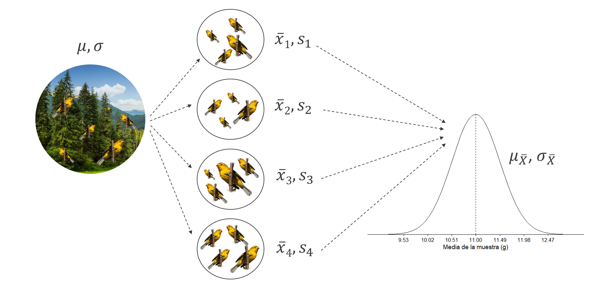

```{r setup, include=FALSE}
library(tidyverse)
library(patchwork)
library(kableExtra)
library(cowplot)
knitr::opts_chunk$set(echo = TRUE)
```

# Clase 3: Probabilidad

## Probabilidad {.build}

La **probabilidad** es una cantidad numérica que expresa qué tan factible es que ocurra un evento. Se expresa como $P(A)$ donde $A$ es un evento aleatorio.

Siempre se encuentra en un rango de 0 a 1. Expresado como porcentaje entre 0% y 100%. Existen distintos acercamientos a la probabilidad como el acercamiento **frecuentista** o el acercamiento **bayesiano.**

En este caso, aprenderemos el enfoque frecuentista como una forma de asignar una probabilidad mensurable a un evento, es decir, la ocurrencia de el evento a la larga (qué tan frecuentemente ocurre).

## Probabilidad frecuentista

En este enfoque, la probabilidad de un evento se determina a través por el número de veces que el evento $A$ ocurre en una serie de repeticiones indefinidamente largas.

$$
P(A) = \frac{Veces \space que \space ocurre \space A}{Número \space total \space de \space repeticiones}
$$

# Reglas de probabilidad

## Reglas de probabilidad {.build}

1- La probabilidad de que un evento $A$ ocurra está siempre entre 0 y 1. 

$$
0 \le P(A) \le 1
$$

2- Siempre y cuando dos eventos sean complementarios, la suma de probabilidades debe ser igual a 1.

$$
P(A) + P(\bar{A}) = 1
$$

3- La probabilidad de que el evento $A$ no ocurra es...

$$
P(\bar{A}) = 1 - P(A)
$$

Donde $P(\bar{A})$ es el **complemento** de $P(A)$.

## Reglas de probabilidad {.build}

4- Si $A$ y $B$ son eventos **disjuntos** (no ocurren en conjunto):

$$
P(A \cup B) = P(A) + P(B)
$$

```{r echo=FALSE, fig.align='center'}
knitr::include_graphics("no_conjuntos.png", dpi = 120)
```

## Reglas de probabilidad {.build}

5- Si $A$ y $B$ son eventos que ocurren en **conjunto:**

$$
P(A \cup B) = P(A) + P(B) - P(A \cap B)
$$

Donde $P(A \cap B)$ es la probabilidad de que ocurra $A$ y $B$ al mismo tiempo.

```{r echo=FALSE, fig.align='center'}
knitr::include_graphics("cojnuntos.png", dpi = 140)
```

## Reglas de probabilidad {.build}

6- Si dos eventos son **independientes,** entonces:

$$
P(A \cap B) = P(A) \times P(B)
$$

## Reglas de probabilidad {.build}

7- Si dos eventos son **dependientes** entonces:

$$
P(A \cap B) = P(A) \times P(B|A)
$$

El valor 𝑃(𝐵|𝐴) corresponde a la probabilidad condicional, y nos dice cuál es la probabilidad de que el evento $B$ ocurra dado que ha ocurrido ya el evento $A$. Para calcular la probabilidad condicional utilizamos:

$$
P(A|B) = \frac{P(A \cap B)}{P(B)} \\
P(B|A) = \frac{P(A \cap B)}{P(A)} \\
P(A|B) \ne P(B|A)
$$

## Reglas de probabilidad {.build}

8- Para dos eventos cualesquiera:

$$
P(A) = P(B) \times P(A|B) + P(\bar{B}) \times P(A|\bar{B})
$$

## Curvas de densidad {.build}

Una **distribución de probabilidad** corresponde a una descripción que da la probabilidad para cada valor de una variable aleatoria. La variable aleatoria puede ser **discreta** o puede ser **continua.**

Un **histogramas de frecuencias relativas** representa las proporciones de las observaciones en cada categoría. 

Para variables continuas normalmente se utilizan clases muy estrechas para representar al histograma como una **curva de densidad.** 

La coordenada $y$ de una curva de densidad representa la escala de densidad y a menudo las frecuencias relativas se representan como **áreas debajo de la curva.**

## Curvas de densidad {.build}

Algunos de los requisitos de una distribución de probabilidad son:

- Que exista una variable aleatoria numérica $x$ y que sus valores estén asociados a una probabilidad.

- Que $\sum P(x) = 1$, donde $x$ asume todos los los valores posibles. El área total bajo la curva de densidad debe ser igual a 1.

- Que la probabilidad de ver a $x_i$ se encuentre entre 0 y 1. Es decir, $0 \le P(x_i) \le 1$.

## Ejemplos

- **Distribución normal**

- **Distribución $t$ de Student** 

- **Distribución de $F$** 

- **Distribución de Chi**

## Ejemplos

```{r echo=FALSE, message=FALSE, warning=FALSE, paged.print=FALSE, fig.align='center'}
data <- data.frame("x" = rnorm(100000, mean = 0, sd = 1))
ggplot(data, aes(x = x)) +
  geom_histogram(aes(y=..density..), colour="black", fill="white") +
  geom_density(size = 0.6) +
  ylab("") +
  xlab("") +
  scale_y_continuous(expand = c(0,0), breaks = NULL) +
  theme_minimal_hgrid(color = "black")
```

## Parámetros de una distribución de probabilidad

- **Media:** $\mu$

- **Varianza:** $\sigma^2$

- **Desviación estándar:** $\sigma$

- **Tamaño de muestra:** $n$

# Distribución binomial

## Distribución binomial {.build}

- Distribución de probabilidad para una **variable discreta.**

- Cuenta el número de éxitos ($k$) tras realizar $n$ veces un experimento. 

- Cada *intento* debe ser independiente entre sí. La probabilidad de éxito es fija entre cada intento y se denota con la letra $p$.

## Distribución binomial

```{r echo=FALSE, fig.align='center'}
knitr::include_graphics("ejemplos.png", dpi = 120)
```

## Variable aleatoria binomial

1.  **Resultados binarios:** Solamente existen dos posibilidades para cada intento (éxito o fracaso, cara o cruz, dominante o recesivo, muerto o vivo, niño o niña, etc.).

2.  **Intentos independientes:** Cada prueba o intento deben ser independientes del anterior.

3.  **El valor de** $n$ es fijo: Se sabe con antelación el número de pruebas $n$.

4.  **Mismo valor** $p$: En todos los casos, la probabilidad de éxito o fracaso no debe cambiar, es decir $p$ debe permanecer constante.

5.  **Resultados mutuamente excluyentes:** Es decir, no se puede tener éxito y fracaso al mismo tiempo.

6.  **Resultados colectivamente exhaustivos:** Al menos uno de los dos resultados debe de ocurrir.

## Función de masa de probabilidad (PMF) {.smaller}

La **función de masa de probabilidad (PMF)** o fórmula de la distribución binomial.

$$
P(X = k) = {\binom{n}{k}}{p^{k}}{q^{n-k}}
$$

Donde:

-   $P(X = k)$ = probabilidad de obtener $k$ éxitos.

-   $\binom{n}{k}$ = coeficiente binomial.

-   $k$ = número de éxitos.

-   $p$ = probabilidad de éxito.

-   $q$ = probabilidad de fracaso.

-   $n$ = número de pruebas. 

## Coeficiente binomial

Corresponde al número de formas en las que se puede acomodar un conjunto dado.

$$
_{n}C_{k} = \binom{n}{k} = \frac{n!}{k!(n-k)!}
$$

## Media y desviación estándar de la distribución binomial {.build}

En este caso la media es el número promedio de éxitos ($k$) y la desviación estándar es qué tan lejos de esta media caen el resto de los valores de la distribución.

$$
\mu = {n}{p}
$$

$$
\sigma = \sqrt{{n}{p}{(1-p)}} = \sqrt{{n}{p}{q}}
$$

También podemos calcular la varianza...

$$
\sigma^2 = {n}{p}{(1-p)} = {n}{p}{q}
$$

## Ejemplo

Supongamos que analizamos a 5 individuos de una población en la que el 37% de las personas presentan un alelo mutante. Las probabilidades de las distintas configuraciones están dadas por la distribución binomial, en donde $n$ = 5 y $p$ = 0.37. ¿Cuál es la probabilidad de que exactamente 2 personas sean mutantes?

Para esto utilizamos las funciones de R...

## Funciones de la distribución binomial

- **dbinom()** nos da un valor exacto de la distribución binomial en el punto indicado.

- **pbinom()** nos da la probabilidad acumulada de un evento.

- **qbinom()** toma el valor de probabilidad que le ponemos como primer argumento y nos da como regreso un número cuya probabilidad acumulada empate con el valor de la probabilidad (también conocida como función cuantil).

- **rbinom()** genera cierta cantidad de número aleatorios de acuerdo con la probabilidad y el número de pruebas realizadas.

## ¿Cuál es la probabilidad de que exactamente 2 personas sean mutantes? {.build}

¿Qué función podríamos utilizar...?

**¡¡dbinom()!!**

## ¿Cuál es la probabilidad de que exactamente 2 personas sean mutantes? {.build}

En este caso $n = 5$, $p = 0.37$ y $k = 2$.

```{r}
dbinom(2, 5, 0.37)
```

## ¿Cuál es la probabilidad de que exactamente 2 personas sean mutantes?

```{r echo=FALSE, message=FALSE, warning=FALSE, paged.print=FALSE, fig.align='center'}

mutantes <- data.frame(n = 0:5, prob = dbinom(x = 0:5, size = 5, prob = 0.37))
mutantes$colour <- ifelse(mutantes$n == 2, "lightblue", "white")

ggplot(mutantes, aes(x = factor(n), y = prob, width = 0.9, fill = colour)) +
  geom_bar(stat = "identity", colour = "black", show.legend = F) +
  geom_text(aes(label = round(prob, 2), y = prob + 0.01), position = position_dodge(0.9), size = 3, vjust = 0) +
  labs(x = "Mutantes (x)", y = "Probabilidad") +
  scale_y_continuous(expand = c(0,0), limits = c(0,0.5)) +
  scale_fill_manual(values = c("lightblue", "white")) +
  theme_classic()

```

## Otro ejemplo...

En Estados Unidos, 85% de la población tiene sangre Rh positivo. Supongamos que tomamos 6 personas y contamos cuántos tiene Rh positivo. En este caso $Y$ representará cuántas personas tienen Rh positivo dentro del grupo de 6.

1. ¿Cuál es la probabilidad de $Y$ = 4?

2. ¿Y la probabilidad de que *al menos* 4 personas sean Rh positivo?

3. ¿Y la probabilidad de que haya *al menos* 1 persona con Rh negativo?

## Otro ejemplo... {.build}

Para el punto 1 buscamos una probabilidad **exacta**, $P(Y = 4)$. Es decir podemos utilizar **dbinom().**

```{r}
#Probabilidad de que 4 personas tengan Rh positivo.
dbinom(4, 6, 0.85)
```

```{r echo=FALSE, fig.align='center', fig.height=3, fig.width=5}

rh <- data.frame(rh = 0:6, prob = dbinom(x = 0:6, size = 6, prob = 0.85))
rh$colour <- ifelse(rh$rh == 4, "lightblue", "white")

ggplot(rh, aes(x = factor(rh), y = prob, width = 0.9, fill = colour)) +
 geom_bar(stat = "identity", colour = "black", show.legend = F) +
  geom_text(aes(label = round(prob, 2), y = prob + 0.01), position = position_dodge(0.9), size = 3, vjust = 0) +
  labs(x = "Personas con Rh +", y = "Probabilidad") +
  scale_y_continuous(expand = c(0,0), limits = c(0,0.5)) +
  scale_fill_manual(values = c("lightblue", "white")) +
  theme_classic()


```

## Otro ejemplo... {.build}

Para el punto 2, buscamos que *al menos* 4 personas tengan Rh +, es decir $P(Y \ge 4) = P(Y = 4) + P(Y=5) + P(Y=6)$.

```{r}
#Probabilidad de que al menos 4 personas (pueden ser 4, 5 o 6) tengan Rh positivo.
pbinom(3, 6, 0.85, lower.tail = FALSE)
```

```{r echo=FALSE, fig.align='center', fig.height=3, fig.width=5}

rh <- data.frame(rh = 0:6, prob = dbinom(x = 0:6, size = 6, prob = 0.85))
rh$colour <- ifelse(rh$rh >= 4, "lightblue", "white")

ggplot(rh, aes(x = factor(rh), y = prob, width = 0.9, fill = colour)) +
 geom_bar(stat = "identity", colour = "black", show.legend = F) +
  geom_text(aes(label = round(prob, 2), y = prob + 0.01), position = position_dodge(0.9), size = 3, vjust = 0) +
  labs(x = "Personas con Rh +", y = "Probabilidad") +
  scale_y_continuous(expand = c(0,0), limits = c(0,0.5)) +
  scale_fill_manual(values = c("lightblue", "white")) +
  theme_classic()

```


## Otro ejemplo... {.smaller .build}

Para el punto 3, buscamos que *al menos* una persona tenga Rh -. Por ende buscamos el complemento de nuestro evento, $P(Y = 0) + P(Y = 1) + P(Y = 2) \cdots + P(Y = 5)$, o lo que es lo mismo $1 - P(Y = 6)$. 


```{r}
#Probabilidad de que al menos 1 persona tenga Rh negativo.
dbinom(0, 6, 0.85) + dbinom(1, 6, 0.85) + dbinom(2, 6, 0.85) + dbinom(3, 6, 0.85) + dbinom(4, 6, 0.85) + dbinom(5, 6, 0.85)

1 - dbinom(6, 6, 0.85)

pbinom(5, 6, 0.85)
```

## Otro ejemplo... {.build}

```{r echo=FALSE, fig.align='center'}

rh <- data.frame(rh = 0:6, prob = dbinom(x = 0:6, size = 6, prob = 0.85))
rh$colour <- ifelse(rh$rh < 6, "lightblue", "white")

ggplot(rh, aes(x = factor(rh), y = prob, width = 0.9, fill = colour)) +
 geom_bar(stat = "identity", colour = "black", show.legend = F) +
  geom_text(aes(label = round(prob, 2), y = prob + 0.01), position = position_dodge(0.9), size = 3, vjust = 0) +
  labs(x = "Personas con Rh +", y = "Probabilidad") +
  scale_y_continuous(expand = c(0,0), limits = c(0,0.5)) +
  scale_fill_manual(values = c("lightblue", "white")) +
  theme_classic()

```

# Distribución de Poisson

## Distribución de Poisson {.build}

Llamada así en honor al matemático francés **Simeón Denis Poisson.** Para eventos aleatorios representados en un intervalo de tiempo determinado, aunque también es utilizada cuando el evento de interés se distribuye en un espacio plano o tridimensional.

```{r echo=FALSE, fig.align='center'}
knitr::include_graphics("ejemplos2.png", dpi = 150)
```


Nuestro suceso de interés ($X$) tiene valores discretos, mientras que nuestro intervalo tiene valores continuos.

## Función de masa de probabilidad (PMF) {.build}

La fórmula de la distribución de Poisson (PMF) es...

$$
P(X = k | \lambda) = \frac{e^{-\lambda}\lambda^k}{k!}
$$

Donde:

* $P(X=k|\lambda)$ = número de observaciones $k$ dado la media $\lambda$.

* $e$ = número de Euler (aproximadamente 2.7183). 

* $\lambda$ = parámetro de la distribución de Poisson, corresponde al promedio de veces que ocurre el evento aleatorio.

## Variable aleatoria de Poisson 

Para que una variable sea considerada una **variable aleatoria de Poisson** se deben de cumplir los siguientes requisitos:

1. Cada evento tiene que ser independiente.

2. Las ocurrencias del evento tienen que ser aleatorias.

3. El número de eventos en un intervalo de tiempo o espacio es infinito ($k = 0, 1, 2, \cdots, \infty$).

4. La probabilidad de que un evento se presente en un intervalo de tiempo es proporcional al intervalo de tiempo o espacio.

5. Se considera que la probabilidad de que dos eventos se presenten en la misma fracción de tiempo es tan pequeña que se puede considerar inexistente.

## Media y desviación estándar de la distribución de Poisson {.build}

La varianza y la media corresponden al mismo valor ($\lambda$) por lo que la desviación estándar sería...

$$
\sigma = \sqrt{\lambda}
$$

## Aproximación a la distribución binomial

Cuando se cumplen las siguientes condiciones:

1. Cuando $p < 0.1$ o $p > 0.9$.

2. Cuando $n \ge 20$. Es todavía mejor si $n \ge 100$.

3. Cuando $np \le 10$.

Utilizada para **eventos raros.**

$$
\mu =  \lambda = np
$$

## Ejemplo... {.build}

En *Escherichia coli*, una célula de cada $10^9$ muta para desarrollar resistencia a la estreptomicina. Si observamos $2 \times 10^9$ células... 

1. ¿Cuál es la probabilidad de que ninguna mute, $P(X = 0|\lambda)$?

2. ¿Cuál es la probabilidad de que al menos una mute, $P(X \ge 1|\lambda)$?

## Ejemplo... {.build}

Estamos hablando de probabilidades demasiado pequeñas, ya que tenemos que encontrar 1 mutante entre $10^9$ células:

$$
p = \frac{1}{10^9} = 0.000000001
$$

Para este caso, podemos utilizar la aproximación a la probabilidad binomial:

$$
\mu = \lambda = np = (2\times10^9) \times \frac{1}{10^9} = 2 \\
$$

Por lo tanto, $\lambda = 2$. Observemos que teníamos un valor de $n$ enorme ($2 \times 10^9$) y una $p$ extremadamente pequeña ($\frac{1}{10^9}$) y a pesar de eso, obtuvimos un valor de $\lambda$ relativamente pequeño.

## Funciones de la distribución de Poisson

Como con la distribución binomial, **R** cuenta con funciones específicas para calcular los valores de una distribución de Poisson.

- **dpois()** nos da un valor exacto de la distribución de Poisson en el punto indicado.

- **ppois()** nos da la probabilidad acumulada de un evento.

- **qpois()** toma el valor de probabilidad que le ponemos como primer argumento y nos da como regreso un número cuya probabilidad acumulada empate con el valor de la probabilidad (también conocida como función cuantil).

- **rpois()** genera cierta cantidad de número aleatorios de acuerdo con la probabilidad y el número de pruebas realizadas.

## Ejemplo... {.build}

Para el primer punto, $P(X = 0|\lambda)$...

```{r}
#Probabilidad de que ninguna célula mute.
dpois(0, 2)
```

```{r, echo=FALSE, fig.align='center', message=FALSE, warning=FALSE, paged.print=FALSE, fig.height=3, fig.width=5}

Pois <- data.frame(muts = 0:9, prob = dpois(0:9, 2, log = F))
Pois$colour <- ifelse(Pois$muts == 0, "lightblue", "white")

ggplot(Pois, aes(x = factor(muts), y = prob, width = 0.9, fill = colour)) +
  geom_bar(stat = "identity", colour = "black", show.legend = F) +
  geom_text(aes(label = round(prob, 2), y = prob + 0.01), position = position_dodge(0.9), size = 3, vjust = 0) +
  labs(x = "Células mutantes", y = "Probabilidad") +
  scale_y_continuous(expand = c(0,0), limits = c(0,0.3)) +
  scale_fill_manual(values = c("lightblue", "white")) +
  theme_classic()

```

## Ejemplo... {.build}

Para el punto 2, $P(X \ge 1|\lambda)$...

```{r}
#Probabilidad de que al menos una célula mute.
1 - dpois(0, 2)
```

```{r echo=FALSE, fig.align='center', fig.height=3, fig.width=5, message=FALSE, warning=FALSE, paged.print=FALSE}

Pois <- data.frame(muts = 0:9, prob = dpois(0:9, 2, log = F))
Pois$colour <- ifelse(Pois$muts >= 1, "lightblue", "white")

ggplot(Pois, aes(x = factor(muts), y = prob, width = 0.9, fill = colour)) +
  geom_bar(stat = "identity", colour = "black", show.legend = F) +
  geom_text(aes(label = round(prob, 2), y = prob + 0.01), position = position_dodge(0.9), size = 3, vjust = 0) +
  labs(x = "Células mutantes", y = "Probabilidad") +
  scale_y_continuous(expand = c(0,0), limits = c(0,0.3)) +
  scale_fill_manual(values = c("lightblue", "white")) +
  theme_classic()

```

# Distribución normal

## Distribución normal {.build}

Corresponde a una curva en *forma de campana* o *gaussiana*, con ciertas características específicas.

Se utiliza para representar la distribución de los valores de una variable $X$, de dos maneras distintas: 

* Como una aproximación a un histograma basado en los valores muestreados de la variable $X$.

* Como una representación idealizada de la distribución poblacional de $X$.

## Distribución normal {.build}

Las curvas con distribución normal toman su forma por dos elementos muy importantes: la **media**, $\mu$ y su **desviación estándar**, $\sigma$.

Cuando se tiene una curva con distribución normal, se expresa de la siguiente manera $X \sim N(\mu, \sigma)$.

No se trata de cualquier curva simétrica, si no de una curva simétrica *específica,* eso lo veremos en su **función de densidad de probabilidad (PDF).**

## Función de densidad de probabilidad (PDF) {.build}

Expresa la altura de la curva como una función de la posición en el eje horizontal. El área bajo la curva acumulada se conoce como **función de densidad acumulada (CDF).**

$$
f(x) = \frac{1}{{\sigma}{\sqrt{2 \pi}}}e^{-\frac{1}{2}(\frac{x-\mu}{\sigma})^2}
$$

El centro de una curva normal es $x = \mu$, los puntos de inflexión están en $x = \mu + \sigma$ y $x = \mu - \sigma$.

En principio la curva se extiende hasta el infinito, pero tres desviaciones estándar de la media hacia el valor negativo o positivo da como resultado valores demasiado pequeños. El ancho y alto de una curva normal están determinados por la desviación estándar $\sigma$.

## Distribución normal

```{r echo=FALSE, fig.align='center', message=FALSE, warning=FALSE, paged.print=FALSE}
ggplot(data.frame(x = c(-4, 4)), aes(x = x)) +
  stat_function(fun = dnorm, size = 0.6) +
  scale_y_continuous(breaks = NULL) +
  ylab("") +
  xlab("") +
  scale_y_continuous(expand = c(0,0), breaks = NULL) +
  scale_x_discrete(limit = c(-3:3), labels = c(expression(-3*sigma), expression(-2*sigma), expression(-sigma), expression(mu), expression(sigma), expression(2*sigma), expression(3*sigma))) +
  theme_minimal_hgrid(color = "black")
```

## Distribución normal {.build}

Normalmente lo que nos interesa de una curva con distribución normal es el **área debajo de la curva.** Para esto utilizamos la **escala estandarizada,** en el cual el valor del eje horizontal se denomina **valor $Z$.**

La escala de $Z$ mide las desviaciones estándar a partir de la media, por ejemplo, $z = 1$ corresponde a una desviación estándar de la media.

```{r echo=FALSE, fig.align='center', message=FALSE, warning=FALSE, paged.print=FALSE, fig.height=3}
ggplot(data.frame(x = c(-4, 4)), aes(x = x)) +
  stat_function(fun = dnorm, size = 0.6) +
  scale_y_continuous(breaks = NULL) +
  ylab("") +
  xlab("") +
  scale_y_continuous(expand = c(0,0), breaks = NULL) +
  scale_x_discrete(limit = c(-3:3), labels = c("-3 z", "-2 z", "-z", expression(mu), "z", "2 z", "3 z")) +
  theme_minimal_hgrid(color = "black")
```

## Escala de $Z$ {.build}

Para transformar nuestros datos a la escala $Z$ simplemente aplicamos la fórmula...

$$
Z = \frac{X - \mu}{\sigma}
$$

La variable $Z$ se le conoce como una variable de **distribución normal estándar,** ya que se encuentra estandarizada y no importa en que valor se encuentren los datos originales (kg, °C, cm, mmHg, etc.), la variable $Z$ es *adimensional.*

## Escala de $Z$ {.build .smaller}

Una vez que nuestras variables se encuentran estandarizadas en el valor $Z$, podemos utilizar **tablas de $Z$** para realizar el cálculo debajo del área que corresponde al valor $Z$ obtenido, aunque claro, también podemos hacer estos cálculos en **R.**

```{r echo=FALSE, fig.align='center'}
knitr::include_graphics("tabla_z.png", dpi = 150)
```

## Propiedades de una curva normal estándar

-  68% del área se encuentra entre $\pm$ 1 distribución estándar.

-  95% del área se encuentra entre $\pm$ 2 distribuciones estándar.

-  99.7% del área se encuentra entre $\pm$ 3 distribuciones estándar.

## Funciones de la distribución normal

- **dnorm()** nos da un valor de densidad normal (PDF).

- **pnorm()** nos da un valor de densidad normal acumulado hasta cierto punto (área debajo de la curva, CDF).

- **qnorm()** toma el valor de densidad normal que le ponemos como primer argumento y nos da como regreso un número cuya densidad normal acumulada empate con el valor de densidad normal ingresado.

- **rnorm()** genera cierta cantidad de número aleatorios de acuerdo al valor de densidad normal.

## Ejemplo... {.build}

En una población de peces de la especie *Pomolobus aestivalis*, la longitud de los individuos sigue una distribución normal. La media de la longitud es de $\bar{x} = 54.0 \space mm$, y la desviación estándar es de $s = 4.5 \space mm^2$. 

1. ¿Qué porcentaje de los peces mide menos de 60 mm?

2. ¿Qué porcentaje de los peces mide más de 51 mm?

3. ¿Qué porcentaje de los peces miden entre 51 mm y 60 mm?

## ¿Qué porcentaje de los peces mide menos de 60 mm? {.build}

Para responder la primer pregunta, debemos transformar nuestros datos a valores $Z$, ya que se encuentran en mm.

```{r}
(60 - 54)/(4.5)
```

Ya que $z = 1.33$, ahora buscamos el área bajo la curva con la función **pnorm().**

```{r}
pnorm(1.33, 0, 1, lower.tail = TRUE)
```

## ¿Qué porcentaje de los peces mide menos de 60 mm? {.build .smaller}

Como podemos ver la probabilidad de que un pez mida menos de 60 mm es de **90.82%.**

```{r echo=FALSE, message=FALSE, warning=FALSE, paged.print=FALSE, fig.align='center'}
ggplot(data.frame(x = c(-4, 4)), aes(x = x)) +
  stat_function(fun = dnorm, geom = "area", fill = "lightblue", xlim = c(-4, 1.33)) +
  stat_function(fun = dnorm, size = 0.6) +
  geom_segment(aes(x = 1.33, y = 0, xend = 1.33, yend = 0.165), linetype = "dashed") +
  #geom_vline(aes(xintercept = 1.33), linetype = "dashed", size = 0.35) +
  geom_text(aes(x = 2.2, label = "Área = 0.9082", y = 0.26), color = "red", vjust = -1.2, size = 4.5) +
  geom_text(aes(x = 2.25, label = "z = 1.33", y = 0.26), color = "black", vjust = -3, size = 4.5) +
  xlim(-4, 4) +
  ylab("") +
  xlab("") +
  scale_y_continuous(expand = c(0,0), breaks = NULL) +
  scale_x_discrete(limit = c(-3:3)) +
  theme_minimal_hgrid(color = "black")
```

## ¿Qué porcentaje de los peces mide más de 51 mm? {.build}

Para la segunda pregunta, primero debemos encontrar el valor de $z$ correspondiente a 51 mm y después basta con cambiar el argumento **lower.tail** a **FALSE.**

```{r}
(51 - 54)/(4.5)

pnorm(-0.67, 0, 1, lower.tail = FALSE)
```

## ¿Qué porcentaje de los peces mide más de 51 mm? {.build .smaller}

El resultado indica que **75.86%** de los peces miden más de 51 mm. Bastante sencillo, ¿no?

```{r echo=FALSE, message=FALSE, warning=FALSE, paged.print=FALSE, fig.align='center'}
ggplot(data.frame(x = c(-4, 4)), aes(x = x)) +
  stat_function(fun = dnorm, geom = "area", fill = "lightblue", xlim = c(-0.67, 4)) +
  stat_function(fun = dnorm, size = 0.6) +
  geom_segment(aes(x = -0.67, y = 0, xend = -0.67, yend = 0.319), linetype = "dashed") +
  #geom_vline(aes(xintercept = -0.67), linetype = "dashed", size = 0.35) +
  geom_text(aes(x = -1.8, label = "Área = 0.7486", y = 0.26), color = "red", vjust = -1.2, size = 4.5) +
  geom_text(aes(x = -1.7, label = "Z = -0.67", y = 0.26), color = "black", vjust = -3, size = 4.5) +
  xlim(-4, 4) +
  ylab("") +
  xlab("") +
  scale_y_continuous(expand = c(0,0), breaks = NULL) +
  scale_x_discrete(limit = c(-3:3)) +
  theme_minimal_hgrid(color = "black")
```

## ¿Qué porcentaje de los peces miden entre 51 mm y 60 mm? {.build}

Simplemente calculamos la probabilidad acumulada hasta nuestro valor $z$ más grande, que en este caso corresponde a 1.33 y le restamos la probabilidad acumulada del valor $z$ más pequeño, que corresponde -0.67.

```{r}
pnorm(1.33, 0, 1) - pnorm(-0.67, 0, 1)
```

## ¿Qué porcentaje de los peces miden entre 51 mm y 60 mm? {.build .smaller}

Como resultado obtenemos que el 65.68% de los peces se encuentran en longitudes de entre 51 mm y 60 mm.

```{r echo=FALSE, message=FALSE, warning=FALSE, paged.print=FALSE, fig.align='center'}
ggplot(data.frame(x = c(-4, 4)), aes(x = x)) +
  stat_function(fun = dnorm, geom = "area", fill = "lightblue", xlim = c(-0.67, 1.33)) +
  stat_function(fun = dnorm, size = 0.6) +
  geom_segment(aes(x = -0.67, y = 0, xend = -0.67, yend = 0.319), linetype = "dashed") +
  geom_segment(aes(x = 1.33, y = 0, xend = 1.33, yend = 0.165), linetype = "dashed") +
  #geom_vline(aes(xintercept = -0.67), linetype = "dashed", size = 0.35) +
  #geom_vline(aes(xintercept = 1.33), linetype = "dashed", size = 0.35) +
  geom_text(aes(x = -1.8, label = "Área = 0.6568", y = 0.26), color = "red", vjust = -1.2, size = 4.5) +
  geom_text(aes(x = -1.7, label = "Z = -0.67", y = 0.26), color = "black", vjust = -3, size = 4.5) +
  geom_text(aes(x = 1.9, label = "Z = 1.33", y = 0.26), color = "black", vjust = -3, size = 4.5) +
  xlim(-4, 4) +
  ylab("") +
  xlab("") +
  scale_y_continuous(expand = c(0,0), breaks = NULL) +
  scale_x_discrete(limit = c(-3:3)) +
  theme_minimal_hgrid(color = "black")
```

## La otra interpretación de la distribución normal {.build}

Si nos damos cuenta, la distribución normal puede, de cierta manera, interpretarse también como una **distribución de probabilidad continua.**

```{r echo=FALSE, message=FALSE, warning=FALSE, paged.print=FALSE, fig.align='center'}
ggplot(data.frame(x = c(-4, 4)), aes(x = x)) +
  stat_function(fun = dnorm, geom = "area", fill = "lightblue", xlim = c(-4, 1.33)) +
  stat_function(fun = dnorm, size = 0.6) +
  geom_segment(aes(x = 1.33, y = 0, xend = 1.33, yend = 0.165), linetype = "dashed") +
  xlim(-4, 4) +
  ylab("") +
  xlab("") +
  scale_y_continuous(expand = c(0,0), breaks = NULL) +
  scale_x_discrete(limit = c(-3:3)) +
  theme_minimal_hgrid(color = "black")
```

## qnorm() {.build}

Supongamos que queremos encontrar el percentil 70 de la distribución de la longitud de los peces. Supongamos que este valor está representado por la variable $y$. En otras palabras, queremos encontrar el valor tal que el 70% de las longitudes de los peces son menores que $y$ y el 30% son mayores.

```{r}
qnorm(0.7, 0, 1)
```

Como podemos ver, el valor $z$ correspondiente es $z = 0.5244$. Podemos realizar un despeje muy sencillo y obtener la fórmula $y = Z \times \sigma + \mu = 0.5244 \times 4.5 + 54 = 56.3$. Esto quiere decir que 56.3 mm es el percentil 70 de la distribución de nuestros datos.

## qnorm () {.build}

```{r echo=FALSE, fig.align='center', message=FALSE, warning=FALSE, paged.print=FALSE}
ggplot(data.frame(x = c(-4, 4)), aes(x = x)) +
  stat_function(fun = dnorm, geom = "area", fill = "lightblue", xlim = c(0.5244, 4)) +
  stat_function(fun = dnorm, size = 0.6) +
  geom_segment(aes(x = 0.5244, y = 0, xend = 0.5244, yend = 0.347), linetype = "dashed") +
  geom_text(aes(x = 1.8, label = "Área = 0.3", y = 0.26), color = "red", vjust = -1.2, size = 4.5) +
  geom_text(aes(x = 2.18, label = "Z = 0.5244", y = 0.26), color = "black", vjust = -3, size = 4.5) +
  xlim(-4, 4) +
  ylab("") +
  xlab("") +
  scale_y_continuous(expand = c(0,0), breaks = NULL) +
  scale_x_discrete(limit = c(-3:3)) +
  theme_minimal_hgrid(color = "black")
```

# Pruebas de normalidad

## Pruebas de normalidad {.build}

Ya que muchos procedimientos estadísticos se basan en datos provenientes de una población con distribución normal, es importante saber si nuestros datos siguen está distribución.

Uno de los métodos más utilizados son los **gráficos cuantil-cuantil**, **gráficos Q-Q** o **Q-Q plot**. Veamos un ejemplo con datos de plantas que vienen incluidas en **ggplot2.**

## Pruebas de normalidad {.build}

```{r}
data("PlantGrowth")
PlantGrowth
```

## Gráficos Q-Q {.build}

Vamos a enfocarnos solamente en los datos del grupo control.

```{r}
control <- PlantGrowth %>% dplyr::filter(group == "ctrl")
```

Ahora vamos a hacer uso de la librería **ggpubr.**

## Gráficos Q-Q {.build}

```{r echo=TRUE, fig.align='center', message=FALSE, warning=FALSE, paged.print=FALSE, fig.height=4, fig.width=5}
library(ggpubr)

ggqqplot(control$weight) +
  labs(x = "Muestra", y = "Teórico")
```

## Prueba de Shapiro-Wilks {.build}

Otra opción para realizar una prueba de normalidad conocida como **prueba de Shapiro-Wilks** (aunque no se recomienda que para $n > 50$). Es muy sensible a ligeras desviaciones de la normalidad, sobre todo con un tamaño de muestra grande.

```{r}
#Indicamos nuestra variable con el símbolo de $.
shapiro.test(control$weight)
```

¿Qué pasa con el valor p?

## Prueba de Shapiro-Wilks {.build}

Valores p menores a 0.05 son indicativos fuertes de no-normalidad. 

Después de obtener un valor menor a 0.05, podríamos corroborar esto con un gráfico Q-Q o con un histograma para ver la forma de la distribución de nuestros datos.

```{r echo=FALSE, message=FALSE, warning=FALSE, paged.print=FALSE, fig.align='center', fig.height=3}
ggplot(control, aes(x = weight)) +
  geom_histogram(binwidth = 0.5, color = "grey20", fill = "lightblue") +
  labs(x = "Peso", y = "Frecuencia") +
  theme_classic()
```

# Distribución muestral

## Distribución muestral {.build}

La variabilidad entre muestras aleatorias que provienen de una misma población se conoce como **variabilidad de muestreo.**

Una distribución de probabilidad que caracteriza algún aspecto de la variabilidad de muestreo se conoce como **distribución muestral.**

Usualmente los valores de una muestra se parecen a los de la población de la cuál provienen.

Una distribución muestral nos indica qué tan cerca la resemblanza entre la muestra y la población es probable que sea.

## Distribución muestral {.build}

Imaginemos que muestreamos de una población de *Chondestes grammacus.*

```{r echo=FALSE, message=FALSE, warning=FALSE, paged.print=FALSE, fig.align='center'}
knitr::include_graphics("dist_muestral.png", dpi = 120)
```

## Distribución muestral

Ahora imaginemos que hacemos el muestreo 50 veces... O tal vez 100, ¿O 200?

```{r echo=FALSE, message=FALSE, warning=FALSE, paged.print=FALSE, fig.align='center'}
knitr::include_graphics("dist_muestral.png", dpi = 120)
```

## Distribución muestral {.build}

Normalmente tomamos solamente una muestra aleatoria de una población. Pero para visualizar la distribución muestral, necesitamos realizar un **meta-estudio,** que consiste en repetir de manera indefinida, réplicas del mismo estudio.

Si un estudio consiste en extraer una muestra aleatoria de tamaño $n$ de una población, un meta-estudio consiste en repetir varias veces la extracción de una muestra de tamaño $n$ de una población.

Las probabilidades relativas de una muestra aleatoria se pueden interpretar como frecuencias relativas en un meta-estudio. Conocer la distribución muestral nos permite hacer afirmaciones de probabilidad de otras posibles muestras.

## ¿Qué tan parecidas son $\overline{X}$ y $\mu$?

Si pensamos en un modelo de muestreo aleatorio y tomamos la media muestral como una variable $\overline{X}$, podemos hacer ciertas inferencias.

Reformulamos nuestra pregunta a ¿Qué tan cerca de $\mu$ es probable que este $\overline{X}$? Nuestra respuesta la encontramos en la **distribución muestral de $\overline{X}$.**

En promedio, la **media de la distribución muestral** $\overline{X}$ equivale a la media de la población $\mu$.

$$
\mu_{\overline{X}} = \mu
$$

## La desviación estándar de una distribución muestral {.build .smaller}

La fórmula de la **desviación estándar de la muestra** es un poco menos intuitiva, aunque si se analiza de manera detallada tiene sentido.

$$
\sigma_{\overline{X}} = \frac{\sigma}{\sqrt{n}}
$$

Mientras el tamaño de muestra incrementa, la desviación estándar de $\overline{X}$ disminuye. Es decir para muestras más grandes existe menos variación.

La **forma** está determinada por el tamaño de muestra y la naturaleza de la población. Si la población $X$ se distribuye de manera normal, entonces la distribución muestral de $\overline{X}$ será también normal, sin importar el tamaño de nuestra $n$.

## Teorema del limite central {.build}

Indica que si obtenemos una $n$ suficientemente grande, la distribución muestral de $\overline{X}$ será aproximadamente normal incluso para muestras cuya población $X$ no se distribuye de manera normal.

## Ejemplo con los gorriones arlequín (*Chondestes grammacus*) {.build}

Supongamos que tenemos una población del Gorrión Arlequín (*Chondestes grammacus*) en la cuál el peso medio es de $\mu = 11 \space g$ y la desviación estándar $\sigma = 1.2 \space g$.

Tomamos una muestra aleatoria de seis aves ($n = 6$). Dejemos que $\overline{x}$ represente la media del peso de las seis aves. Ya que sabemos que el peso de esta ave sigue una distribución normal en la población, también nuestras muestras seguirán una distribución normal.

$$
\mu_{\overline{X}} = \mu = 11 \space g\\
\sigma_{\overline{X}} = \frac{\sigma}{\sqrt{n}} = \frac{1.2}{\sqrt{6}} = 0.49 \space g
$$

## Ejemplo con los gorriones arlequín {.build} 

En este caso $\mu_{\overline{X}} = 11 \space g$ y $\sigma_{\overline{X}} = \space 0.49 g$. De tal manera que, en promedio la media de la muestra será 11 g, sin embargo, el 68% de las veces $\overline{X}$ se encontrará entre $11 \space g \pm 0.49 \space g$ y el 95% de las veces se encontrará entre $11 \space g \pm 0.98g$.

```{r echo=FALSE, message=FALSE, warning=FALSE, paged.print=FALSE, fig.align='center', fig.height=3}
ggplot(data.frame(x = c(9, 13)), aes(x = x)) +
  stat_function(fun = dnorm, args = list(mean = 11, sd = 0.49), size = 0.6) +
  geom_vline(xintercept = 11, linetype = "dashed") +
  xlim(9, 13) +
  ylab("") +
  xlab("Media de la muestra (g)") +
  scale_y_continuous(expand = c(0,0), breaks = NULL) +
  scale_x_continuous(breaks = c(9.53, 10.02, 10.51, 11, 11.49, 11.98, 12.47)) +
  theme_minimal_hgrid(color = "black")
```

## Ejemplo con los gorriones arlequín {.build} 

Esta distribución muestral expresa distintas posibilidades para los valores de $\overline{X}$.

Supongamos que quisiéramos saber la probabilidad de que la media de una muestra de seis aves sea mayor a 11.5 g. Ya que nuestros datos son
normales, podemos usar la transformación a valores $z$ para obtener nuestro resultado.

$$
z = \frac{\overline{x}-\mu_\overline{X}}{\sigma_{\overline{X}}} = \frac{11.5 \space g - 11 \space g}{0.49 \space g} = 1.0204
$$

## Ejemplo con los gorriones arlequín {.build} 

Ya que nuestro valor $z = 1.0204$, usamos la función **pnorm()** para encontrar nuestra área bajo la curva.

```{r}
pnorm(1.0204, mean = 0, sd = 1, lower.tail = FALSE)
```

De hecho, ni siquiera es necesario realizar la transformación a valores $z$ en **R** ya que podemos modificar los parámetros de la función **pnorm()**.

```{r}
pnorm(11.5, mean = 11, sd = 0.49, lower.tail = FALSE)
```

## Ejemplo con los gorriones arlequín {.build .smaller} 

Si eligiéramos muchas muestras aleatorias provenientes de esta población cerca del 15% de las muestras tendrían una media mayor a 11.5 g. 

$$
P(\overline{X} > 11.5) = P(Z > 1.0204) = 0.1538 \approx 0.15
$$

```{r echo=FALSE, message=FALSE, warning=FALSE, paged.print=FALSE, fig.align='center', fig.height=3}

ggplot(data.frame(x = c(9, 13)), aes(x = x)) +
  stat_function(fun = dnorm, args = list(mean = 11, sd = 0.49), geom = "area", fill = "lightblue", xlim = c(11.5,13)) +
  stat_function(fun = dnorm, args = list(mean = 11, sd = 0.49), size = 0.6) +
  geom_segment(aes(x = 11.5, y = 0, xend = 11.5, yend = 0.484), linetype = "dashed") +
  #geom_vline(aes(xintercept = 11.5), linetype = "dashed", size = 0.35) +
  geom_text(aes(x = 12, label = "Área = 0.1538", y = 0.4), color = "red", vjust = -0.8, size = 4.5) +
  geom_text(aes(x = 12.08, label = "z = 1.0204", y = 0.4), color = "black", vjust = -2.6, size = 4.5) +
  xlim(9, 13) +
  ylab("") +
  xlab("Media de la muestra (g)") +
  scale_y_continuous(expand = c(0,0), breaks = NULL) +
  scale_x_continuous(breaks = c(9.53, 10.02, 10.51, 11, 11.49, 11.98, 12.47)) +
  theme_minimal_hgrid(color = "black")

```

## El tamaño de la muestra {.build}

El **tamaño de la muestra** tiene un efecto directo sobre la forma de nuestra curva. Básicamente, muestras más grandes dan un $\sigma_\overline{X}$ menor, y por ende dan un menor error de muestreo. 

En seguida se muestran distintas gráficas con distintas $\mu_\overline{X}$. Para este caso hipotético, $\mu = 100, \sigma = 40$.

```{r echo=FALSE, message=FALSE, warning=FALSE, paged.print=FALSE, fig.align='center', fig.height=3}
library(patchwork)
p1 <- ggplot(data.frame(x = c(40, 160)), aes(x = x)) +
  stat_function(fun = dnorm, args = list(mean = 100, sd = 20), size = 0.6) +
  geom_text(aes(x = 150, y = 0.015, label = "n == 4"), parse = TRUE) +
  geom_text(aes(x = 150, y = 0.0135, label = "sigma[bar(X)] == 20"), parse = TRUE) +
  xlim(40, 160) +
  ylab("") +
  xlab("") +
  scale_y_continuous(expand = c(0,0), breaks = NULL) +
  theme_minimal_hgrid(color = "black")

p2 <- ggplot(data.frame(x = c(40, 160)), aes(x = x)) +
  stat_function(fun = dnorm, args = list(mean = 100, sd = 10), size = 0.6) +
  geom_text(aes(x = 140, y = 0.029, label = "n == 16"), parse = TRUE) +
  geom_text(aes(x = 140, y = 0.026, label = "sigma[bar(X)] == 10"), parse = TRUE) +
  xlim(40, 160) +
  ylab("") +
  xlab("") +
  scale_y_continuous(expand = c(0,0), breaks = NULL) +
  theme_minimal_hgrid(color = "black")

p1 + p2
```

## El tamaño de la muestra {.build}

Qué tan cerca esta $\overline{X}$ de $\mu$ depende del tamaño de la muestra $n$.

La media de una muestra grande no necesariamente está más cerca a la media poblacional que la media de una muestra pequeña, pero existe mayor probabilidad de que lo este.

## Poblaciones, muestras y distribuciones muestrales {.build .smaller}

En una **población**, los estadísticos descriptivos como la media y la desviación estándar se representan por los siguientes símbolos:

- $\mu$: media poblacional.   

- $\sigma$: desviación estándar poblacional.

En una **muestra**, los mismos estadísticos se representan por los siguientes símbolos:

- $\overline{x}$: media muestral.

- $s$: desviación estándar poblacional.

En una **distribución muestral** lo que nosotros hacemos es repetir un muestreo indefinidas veces y de cada muestreo extraer la media muestral $\overline{x}$. La distribución muestral representa una distribución de medias.

- $\mu_\overline{X}$: media de una distribución muestral.

- $\sigma_\overline{X}$: desviación estándar de una distribución muestral.

## Poblaciones, muestras y distribuciones muestrales {.build} 

```{r echo=FALSE}

```

